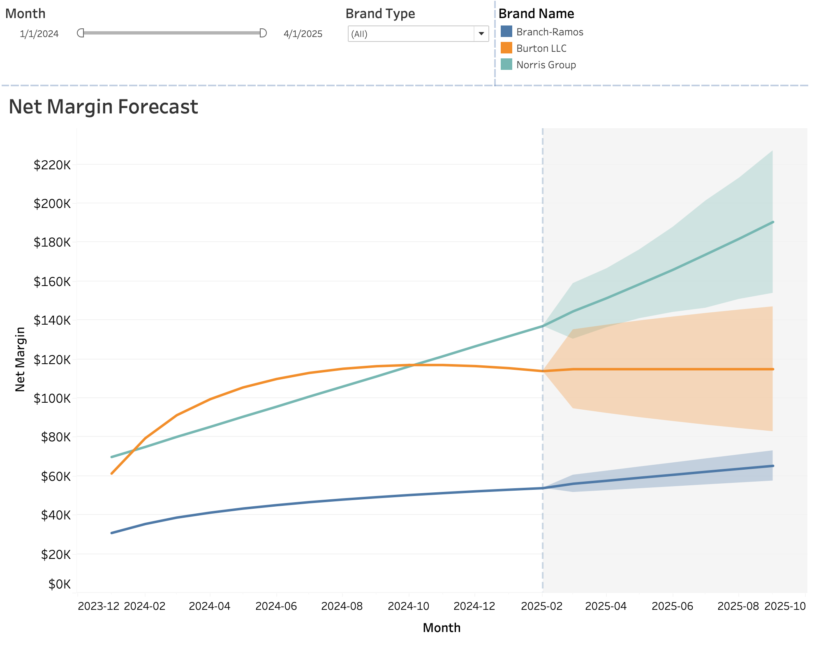

# Committed Cash View Report

This project provides a committed cash view report for forecasting and visibility into revenue and costs. It is designed to offer brand-level transparency for over 100 brands, including sports clubs and event companies. The report compiles all revenue and cost streams, enabling sales target forecasting and performance tracking.

## Features
- **Revenue and Cost Forecasting**: Generates monthly forecasts for total revenue and costs.
- **Brand-Level Transparency**: Breaks down revenue and costs by brand and stream.
- **Data Visualization**: Supports visual insights for decision-making.

## How It Works
1. **Data Generation**: The `generate_data.py` script creates synthetic data for revenue and cost trends.
2. **Output**: The data is saved as an Excel file (`committed_cash_view_with_trends.xlsx`) for further analysis and visualization.

## Screenshot


## Replay
**Jump to Step 3 is recommended** to replay the dashboard in above screenshot with the exactly same statistics
1. (Optional) Install dependencies:
   ```bash
   eval $(poetry env activate)
   ```
2. (Optional) Run the data generation script, but it will overwrite the `.xlsx` file on the repo:
   ```bash
   python generate_data.py
   ```
3. Open the generated Excel file `ommitted_cash_view_with_trends.xlsx` for analysis.
4. Open the `.twb` Tableau workbook file to take a look at visualization

## Future Enhancements
- Integration with live data sources.
- Advanced visualizations and dashboards.
- Enhanced forecasting models.
